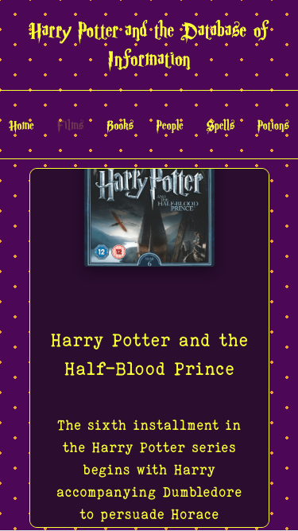

# Harry Potter API

Welcome to the **Harry Potter API**, your magical gateway to exploring the enchanting world of Harry Potter! This API provides access to a comprehensive collection of information about the Harry Potter films, books, characters, spells, and potions. Whether you're a developer, a Potterhead, or just curious about the wizarding world, this API will delight and inspire you with its whimsical aesthetic and detailed data. 

The website is deployed at https://harry-potter-api.surge.sh

## Desktop Preview


## Mobile Preview



## Features

- **Films**: Access information about all the Harry Potter films, including titles, release dates, directors, and synopses.
- **Books**: Retrieve details about the Harry Potter books, such as titles, publication dates, authors, and summaries.
- **Characters**: Discover your favorite characters, their house affiliations, birthdates, and other fascinating details.
- **Spells**: Learn about the magical spells, their incantations, effects, and uses.
- **Potions**: Uncover the secrets of potions, their ingredients, effects, and brewing instructions.

## Endpoints

### Films

- **List**: `GET /films` - Retrieve a list of all Harry Potter films.
- **Detail**: `GET /films/:id` - Get detailed information about a specific film.

### Books

- **List**: `GET /books` - Retrieve a list of all Harry Potter books.
- **Detail**: `GET /books/:id` - Get detailed information about a specific book.

### Characters

- **List**: `GET /people` - Retrieve a list of all Harry Potter characters.
- **Detail**: `GET /people/:id` - Get detailed information about a specific character.

### Spells

- **List**: `GET /spells` - Retrieve a list of all magical spells.
- **Detail**: `GET /spells/:id` - Get detailed information about a specific spell.

### Potions

- **List**: `GET /potions` - Retrieve a list of all potions.
- **Detail**: `GET /potions/:id` - Get detailed information about a specific potion.

## Response Format

All responses are in JSON format. Below is an example response for a character endpoint:

```json
{
  "id": "1",
  "name": "Harry Potter",
  "house": "Gryffindor",
  "birthdate": "1980-07-31",
  "patronus": "Stag",
  "blood_status": "Half-blood",
  "wand": "11\" Holly"
}
